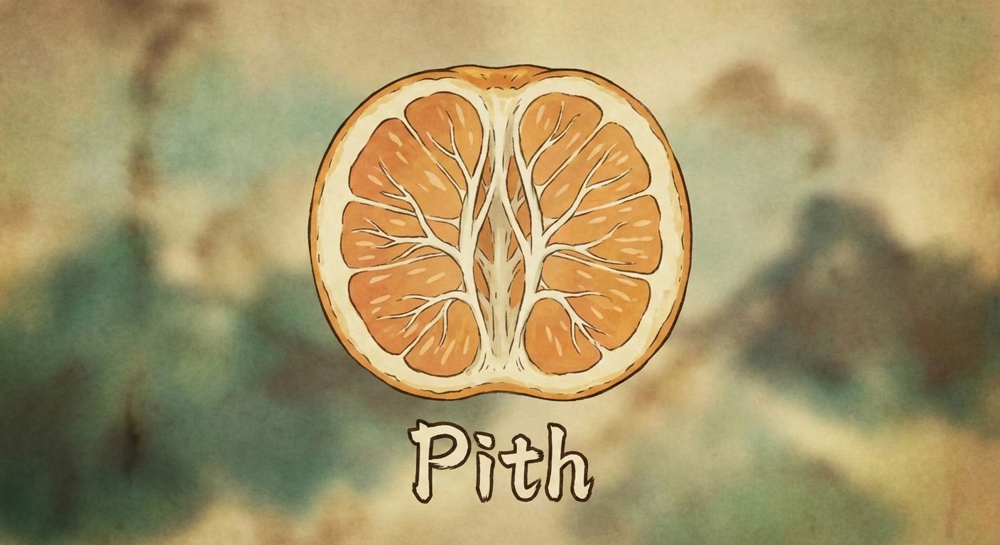

# pith



Generate structured codebase context for LLM consumption.

## What is pith?

Pith extracts the essential structure of a codebase into a format optimized for large language models. Rather than dumping raw source files, pith produces **codemaps**: AST-extracted declarations, imports, and signatures that capture what exists in your code without the implementation noise.

The output is designed around three goals:

- **Token efficiency**: Codemaps capture the shape of code (what functions exist, what they accept and return) using fewer tokens than full source
- **Structural clarity**: Organized sections (`<file_map>`, `<codemaps>`, `<selected_files>`) help LLMs parse and reason about code structure
- **Selective disclosure**: Include full source only for files you're actively working on; use codemaps for surrounding context

Pith is both a CLI tool and a Rust library.

## Quick Start

```bash
# Generate context for current directory, copy to clipboard
pith context . | pbcopy

# Then paste into Claude, ChatGPT, or your LLM of choice
```

## Supported Languages

| Language   | Extensions              |
|------------|-------------------------|
| Rust       | `.rs`                   |
| TypeScript | `.ts`, `.tsx`           |
| JavaScript | `.js`, `.jsx`, `.mjs`, `.cjs` |
| Python     | `.py`, `.pyi`           |
| Go         | `.go`                   |

Extraction uses [tree-sitter](https://tree-sitter.github.io/) for accurate parsing.

## CLI Usage

### Commands

```
pith tree <PATH>       # Display file tree with metadata
pith codemap <PATH>    # Extract API signatures only
pith context <PATH>    # Full context: tree + codemaps + selected files
pith tokens <PATH>     # Count tokens for budget planning
pith languages         # Show supported languages
```

### Key Options

```
--select <PATTERN>     # Include full source for matching files (glob)
--lang <LANG>          # Filter to specific language(s)
--json                 # Output as JSON (for programmatic use)
--include-docs         # Include doc comments in codemaps
--include-private      # Include private/internal items
```

### Example: Generate context with selected files

```bash
pith context ./src --select "**/api/*.rs"
```

### Example Output

```xml
<file_map>
src/
├── api/
│   ├── handlers.rs [rust, 245 lines, 6.2KB] *+
│   └── routes.rs [rust, 89 lines, 2.1KB] *+
├── db/
│   └── queries.rs [rust, 156 lines, 4.1KB] +
└── lib.rs [rust, 42 lines, 1.0KB] +

Legend: * = selected, + = has codemap
</file_map>

<codemaps>
## src/db/queries.rs

### Imports
- use sqlx::{Pool, Postgres}
- use crate::models::{User, Post}

### Declarations

#### pub async fn get_user (pool: &Pool<Postgres>, id: i64) -> Result<User> (lines 12-18)

#### pub async fn list_posts (pool: &Pool<Postgres>, limit: i32) -> Result<Vec<Post>> (lines 20-31)

---

## src/lib.rs

### Imports
- use api::{handlers, routes}

### Declarations

#### pub fn create_app () -> Router (lines 8-15)

</codemaps>

<selected_files>
--- src/api/handlers.rs (245 lines, 1,823 tokens) ---
// Full file content here...

--- src/api/routes.rs (89 lines, 672 tokens) ---
// Full file content here...
</selected_files>

<token_summary>
Total: 3,241 tokens

Component breakdown:
- File tree: 89 tokens
- Codemaps: 657 tokens
- Selected files: 2,495 tokens
</token_summary>
```

## Understanding the Output

- **`<file_map>`**: Directory tree with metadata. `*` marks selected files (full content included), `+` marks files with codemaps.
- **`<codemaps>`**: Per-file API signatures extracted via tree-sitter. Shows imports, function signatures, struct definitions, etc. without implementation bodies.
- **`<selected_files>`**: Full source content for files matching `--select` patterns.
- **`<token_summary>`**: Token counts for budget planning against context limits.

## Library Usage

```rust
use pith::{Pith, Language};

let result = Pith::new("./my-project")
    .languages(&[Language::Rust, Language::TypeScript])
    .include_docs(true)
    .build()?;

println!("Files: {}", result.codemaps.len());
println!("Tokens: {}", result.total_tokens());
```

Pith automatically respects `.gitignore` and detects binary/minified/generated files.

## Limitations

- **Language coverage**: Currently supports Rust, TypeScript, JavaScript, Python, and Go. No C/C++, Java, Ruby, etc.
- **Partial parsing**: Syntactically invalid code may produce incomplete codemaps.
- **No semantic analysis**: Type resolution is not performed. Import paths are extracted as-is.

This is a young project. API may change between versions.

## Contributing

Issues and pull requests welcome. Please run `cargo test` before submitting.

## License

MIT
